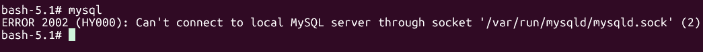
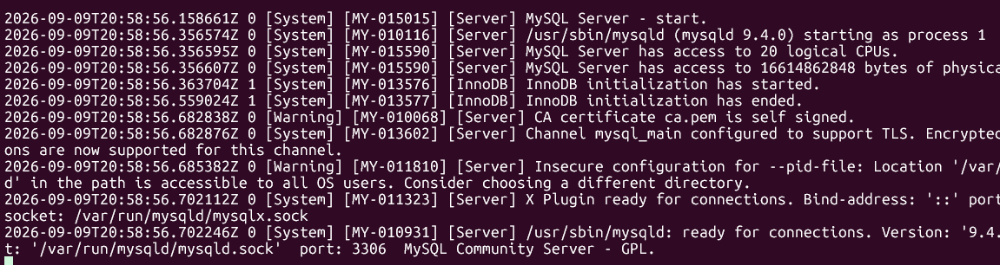
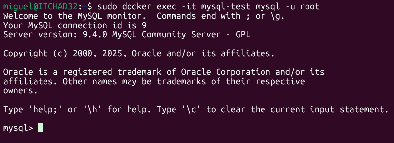

# Uso de contenedores

## Ejecutar la imagen de mysql con comando bash

```
sudo docker run --name mysql-test -it mysql bash
```
:books: Notas.

- Al intentar ingresar a MySQL muestra un error; pero es normal, abajo está la explicación.  
    
- Este contenedor es tan minimalista que no dispone ni del comando `clear` para borrar la pantalla y otros comandos de uso común en Linux.  
- Con el comando `cat /etc/system-release` encontré que es una distribución de `Oracle Linux Server release 9.6`.  
- La imagen oficial de MySQL tiene un ENTRYPOINT que normalmente se encarga de inicializar y arrancar el servidor MySQL; pero en el ejemplo se está ejecutando el comando `bash` no el servicio de `MySQL` 

## Ejecutar el servicio de mysql en primer plano

```
sudo docker run --name mysql-test -e MYSQL_ALLOW_EMPTY_PASSWORD=yes mysql
```
  

Se ejecuta el servicio; pero no podemos ingresar a la consola de mysql para interactuar con el servidor.  

## Ejecuta el contenedor de mysql en segundo plano

```
sudo docker run --name mysql-test -e MYSQL_ALLOW_EMPTY_PASSWORD=yes -d mysql
```
:large_orange_diamond: Parámetros
- `-d mysql` indica que mysql ejecutará `mysql` en segundo plano. El contenedor queda en ejecución y solo muestra un identificador como `0a1f19c8fdb5ff37816e834ad2b287d0f58f97af35493e12ad3a3523f956d579`. El contenedor queda en ejecución, listo para recibir conexiones. `-d` significa `detached (desacoplado)`. 
- `-e MYSQL_ALLOW_EMPTY_PASSWORD=yes` indica que el usuario `root` no tendrá contaseña, esto está bien para entorno de pruebas solamente pero no para un ambiente en producción.  

Para ingresar a la terminal de `MySQL` ejecute el siguiente comando:  

```
sudo docker exec -it mysql-test mysql -u root
```

  


## Ver la lista de contenendores

:white_check_mark: Lista de contenedores que se encuentran en ejecución  

```
sudo docker container ls
```

:white_check_mark: Lista de contenedores incluyendo los contenedores finalizados    

```
sudo docker container ls -a
```

## Eliminar un contenendor  

En el ejemplo, se pretende eliminar el contenedor con PID a7b6d145cac2.  

```
sudo docker container rm a7b6d145cac2
```

## Ejecutar de manera interactiva un contenedor de alpine 

```
sudo docker run --rm -it alpine
```

Una vez ejecutado el contenendor, se pide que consulte la información del SO. Para ello, ejecute el comando `cat /etc/os-release` 

Verá un resultado como el siguiente:  


## Listar todas las imágenes  

```
sudo docker images
```

## Listar solo los IDs de las imágenes

```
sudo docker images -q
```

## Eliminar un contenedor

Se pide eliminar el contenedor mysql-test.  

```
sudo docker container rm mysql-test
```

## Ejecute un contenedor de ubuntu de manera interactiva. El comando a ejecutar es bash.

```
docker container run -it ubuntu bash
```

***es equivalente a***  
```
docker container run --rm --interactive --tty ubuntu bash
```

**Recordatorio** -i = interactive, -t = --tty`

## Ejecute un contenedor de PHP de manera interactiva

Se ejecutará el comando `php -a` que permite ejecutar comandos de PHP de manera interactiva mediante una terminal.  
```
docker container run --rm --interactive --tty php php -a
```
donde **php** es la imagen y **php -a** es el comando que se está ejecutando en el contenedor.  Ahora puede ejeucutar comandos de php dentro del contenedor.  

ejemplos:  
```
echo "Bienvenidos a PHP";
echo 4 + 10;
echo phpinfo();
```

## Ejecute un contenedor de node de manera interactiva  

```
sudo docker container run --rm -it node node
```

donde la primera palabra **node** es el nombre de la imagen y la segunda palabra **node** es el comando que se está ejecutando dentro del contenedor.  

📗 Comandos que puede probar en el contenedor de node:  
```
console.log("Hola desde Node")
const os =require('node:os')
console.log(os.cpus())
console.log(os.homedir())
console.log(os.machine())
console.log(os.networkInterfaces())
```
**.exit** para salir

## Ejecutar un contenedor de hello-world

El parámetro **--rm** indica que elimine el contenedor una vez finalizada la ejecución del comando.  

```
sudo docker container run --name hello --rm hello-world
```

# Publicar un servicio en un puerto

## Publique el servicio de nginx

```
+-----------Host----------+
-                         -
-    +---container---+    -
-    -     nginx     -    -
-    -               -    -
-    -               -    -
-    +-------80------+    -
-             |           -
-             |           -
+-----------8080----------+
              |
              |
        Navegador web
```

```
sudo docker container run --rm --publish 8080:80 nginx
```

📗 Nota. Consulte en el servidor desde el navegador web del host (http://localhost:8080)  

## Ejecutar mysql en primer plano

```
+-----------Host------------+
-                           -
-                           -
-    +----container-----+   -
-    -      mysql       -   -
-    -                  -   -
-    +-------3306-------+   -
-             |             -
-             |             -
+------------3306-----------+
              |
              |
     Cliente de base de datos
```


```
docker container run --name mysql8 --rm --env MYSQL_ROOT_PASSWORD=12345 --publish 3306:3306 mysql:8.0
```
▶️ Se pide utilizar una interfaz gráfica como HeidiSQL, DBeaver, phpMyAdmin, etc. para conectarse a la base de datos desde el equipo host (Microsoft Windows 11)  
▶️ El host a utilizar es **127.0.0.1**  
▶️ La clave establecida para el usuario **root** es **12345**  

**CTRL+C** para cerrar el contenedor. 👁️El contenedor aún queda en ejecución.  

📙 El contenedor se puede detener con uno de los siguientes comandos:  

```
sudo docker container stop <nombre contenedor>
```

```
sudo docker container stop <PID>
```

## Ejecutar mysql en segundo plano

```
+-----------Host------------+
-                           -
-                           -
-    +----container-----+   -
-    -      mysql       -   -
-    -                  -   -
-    +-------3306-------+   -
-             |             -
-             |             -
+------------3306-----------+
              |
              |
     Cliente de base de datos
```

```
docker container run -d --name mysql8 --rm --env MYSQL_ROOT_PASSWORD=12345 --publish 3306:3306 mysql:8.0
```

## Instalar cliente de mysql en Ubuntu

```
sudo apt update
sudo apt install -y mysql-client
```
## Ingresar al servidor de MySQL que se está ejecutando en el contenedor

```
mysql --host=127.0.0.1 --port=3306 --user=root --password=12345
```

## Ejecutar un contenedor de mongodb en segundo plano

```
sudo docker run --name mongodb-container -d -p 27017:27017 mongo:latest
```

## Ingresar a la shell de mongo

```
sudo docker exec -it mongodb-container mongosh
```

***Para ver las bases de datos***  

```
show databases
```

***Para trabajar con una base de datos***

```
use mybasedatos
```

👓 Ver contenedores en ejecución:  

```
sudo docker ps
```

## Ejecutar un contenedor de PostreSQL en segundo plano y publicar el servicio en el puerto 5432

```
sudo docker run --name mipostgres -e POSTGRES_PASSWORD=12345 -d -p 5432:5432 postgres:15
```

## Conectarse al servicio de PostgreSQL  

```
sudo docker exec -it mipostgres psql -U postgres
```

🔑 Por alguna razón... no pide la clave (pendiente de investigar).  

**Mostrar las bases de datos**  

```
SELECT current_database();
```
o

```
\list
```

o

```
SELECT * FROM pg_catalog.pg_database;
```

## Conectarse a una base de datos

```
\connect postgres
```


Referencia:
[Docker CLI Reference](https://docs.docker.com/reference/cli/docker/)  


